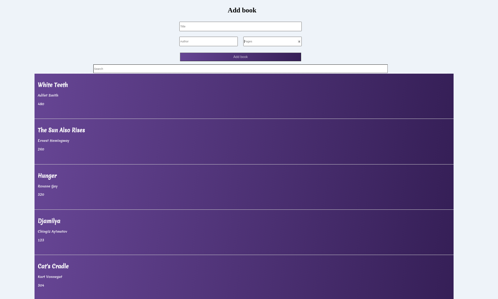

# _Library_

#### _Version 1_
#### _Date 10/26/2020_
#### By _**Adilet Momunaliev**_

## Description

_Library shows list of books,adds a new book, Sorts by ascending and descending order,and Searches.During the process hooks were used._

## Getting Started

These instructions will get you a copy of the project up and running on your local machine for development and testing purposes.

### Instruction

* Node js in your local machine
* git clone
* npm install
* npm run start
### Specifications
 ;
## Technologies Used

_HTML, CSS, JavaScript,Async functions,React Hooks, IDE Atom_

### License

*_Copyright (c) 2020 **Adilet Momunaliev**_*
